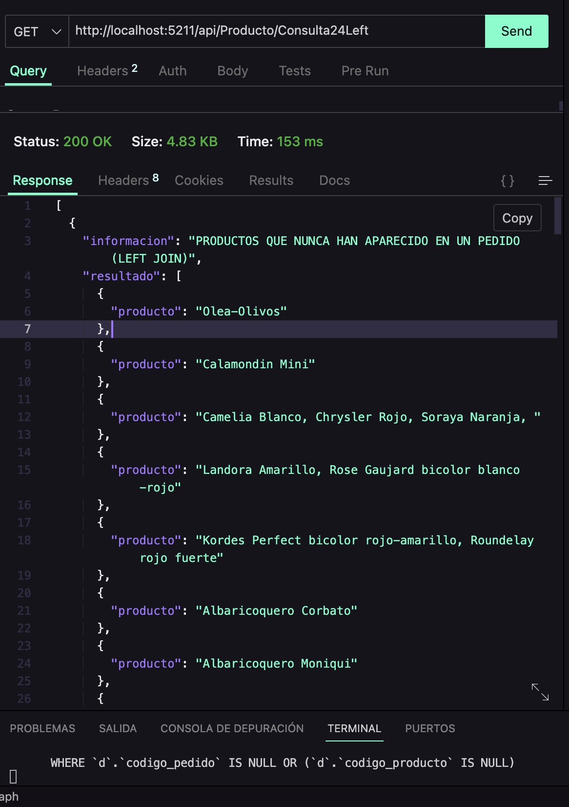
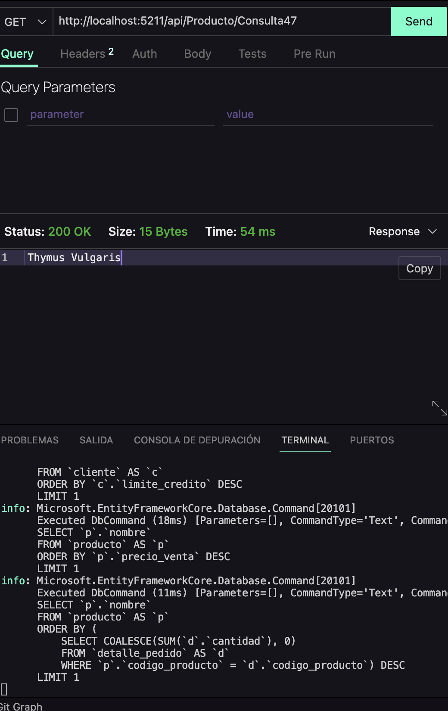

# API para Gestión de Jardinería

## Descripción del Proyecto

Este proyecto es una API diseñada para la gestión de tiendas y servicios relacionados con la jardinería. Proporciona una solución integral para la administración de bases de datos y operaciones CRUD (Crear, Leer, Actualizar, Eliminar) sobre las distintas entidades del negocio, tales como clientes, productos, órdenes, servicios de jardinería y más. 

La API ha sido desarrollada utilizando tecnologías modernas y está estructurada para facilitar la implementación y el mantenimiento de datos relacionados con una tienda de jardinería, ofreciendo eficiencia y escalabilidad.

## Características Principales

* **Migraciones de Base de Datos**: Configuración rápida y sencilla para crear y mantener la estructura de la base de datos.
* **CRUD Completo**: Implementación completa de operaciones CRUD para todas las entidades.
* **Endpoints Eficientes**: Endpoints bien organizados para interactuar con los datos de manera intuitiva y eficiente.
* **Diseño Modular**: Estructura del proyecto modular para facilitar la escalabilidad y el mantenimiento.

## Entidades Principales

* **Clientes**: Información sobre los clientes que realizan compras o solicitan servicios de jardinería.
* **Productos**: Artículos disponibles en la tienda (plantas, herramientas, fertilizantes, etc.).
* **Servicios**: Servicios ofrecidos como mantenimiento de jardines, instalación de sistemas de riego, poda, etc.
* **Órdenes**: Información sobre las compras realizadas por los clientes.
* **Empleados**: Detalles de los empleados, especialmente los jardineros y personal de ventas.

## Configuración Inicial

### Requisitos Previos

1. .NET SDK instalado en el sistema.
2. Base de datos configurada (compatible con EF Core).

### Pasos para Ejecutar el Proyecto

1. Clona el repositorio del proyecto:
   ```bash
   git clone <https://github.com/tu_usuario/jardineria-api.git>
   ```

2. Navega a la carpeta de persistencia:
   ```bash
   cd ./Persistencia
   ```

3. Aplica las migraciones para configurar la base de datos:
   ```bash
   dotnet ef database update --project ./Persistencia --startup-project ./Api
   ```

4. Inicia el servidor:
   ```bash
   dotnet run --project ./Api
   ```

5. Accede a los endpoints de la API a través de tu navegador o herramienta de prueba como Postman.

## Tecnologías Utilizadas

* **Framework**: .NET Core
* **ORM**: Entity Framework Core
* **Base de Datos**: Compatible con SQL Server, PostgreSQL u otros.
* **Servidor Web**: Kestrel

## Licencia

Este proyecto está licenciado bajo la MIT License.

---

Este README te proporciona una guía completa para configurar y ejecutar el proyecto, adaptado a las necesidades de una jardinería. Si necesitas algún cambio o personalización adicional, no dudes en comentarlo.

Este README proporciona una guía clara y organizada para las consultas SQL requeridas.

## Queries Disponibles en Este Proyecto

http://localhost:5211/api/{controller}

## 1. Clientes Españoles

Obtener un listado con el nombre de todos los clientes españoles.

**URL de la consulta:** [http://localhost:5211/api/Cliente/Consulta1](#)  
**Imagen:** 

## 2. Estados de Pedidos

Obtener un listado con los distintos estados por los que puede pasar un pedido.

**URL de la consulta:** [http://localhost:5211/api/Pedido/Consulta2](#)  
**Imagen:** 

## 3. Clientes con Pagos en 2008

Devolver un listado con el código de cliente de aquellos clientes que realizaron algún pago en 2008.

**URL de la consulta:** [http://localhost:5211/api/Pago/Consulta3ConYear](#)  
**Imagen:** 

## 4. Pedidos No Entregados a Tiempo

Devolver un listado con el código de pedido, código de cliente, fecha esperada y fecha de entrega de los pedidos que no han sido entregados a tiempo.

**URL de la consulta:** [http://localhost:5211/api/Pedido/Consulta4](#)  
**Imagen:** 

## 5. Pedidos con Fecha de Entrega Anticipada

Devolver un listado con el código de pedido, código de cliente, fecha esperada y fecha de entrega de los pedidos cuya fecha de entrega ha sido al menos dos días antes de la fecha esperada.

**URL de la consulta:** [http://localhost:5211/api/Pedido/Consulta5](#)  
**Imagen:** 

## 6. Pedidos Rechazados en 2009

Devolver un listado de todos los pedidos que fueron rechazados en 2009.

**URL de la consulta:** [http://localhost:5211/api/Pedido/Consulta6](#)  
**Imagen:** 

## 7. Pedidos Entregados en Enero

Devolver un listado de todos los pedidos que han sido entregados en el mes de enero de cualquier año.

**URL de la consulta:** [http://localhost:5211/api/Pedido/Consulta7](#)  
**Imagen:** 

## 8. Pagos en 2008 mediante PayPal

Devolver un listado con todos los pagos que se realizaron en el año 2008 mediante PayPal. Ordenar el resultado de mayor a menor.

**URL de la consulta:** [http://localhost:5211/api/Pago/Consulta8](#)  
**Imagen:** 

## 9. Formas de Pago Únicas

Devolver un listado con todas las formas de pago que aparecen en la tabla pago. Tener en cuenta que no deben aparecer formas de pago repetidas.

**URL de la consulta:** [http://localhost:5211/api/Pago/Consulta9](#)  
**Imagen:** 

## 10. Productos Ornamentales con Stock > 100

Devolver un listado con todos los productos que pertenecen a la gama Ornamentales y que tienen más de 100 unidades en stock. El listado deberá estar ordenado por su precio de venta, mostrando en primer lugar los de mayor precio.

**URL de la consulta:** [http://localhost:5211/api/Producto/Consulta10](#)  
**Imagen:** 

## 11. Clientes de Madrid con Representante 11 o 30

Devolver un listado con todos los clientes que sean de la ciudad de Madrid y cuyo representante de ventas tenga el código de empleado 11 o 30.

**URL de la consulta:** [http://localhost:5211/api/Cliente/Consulta11](#)  
**Imagen:** 

## 12. Listado de Clientes y Representantes de Ventas

Obtener un listado con el nombre de cada cliente y el nombre y apellido de su representante de ventas.

### Utilizando SQL2 INNER JOIN

**URL de la consulta:** [http://localhost:5211/api/Cliente/Consulta12Sql2I](#)  
**Imagen:** 

### Utilizando SQL2 NATURAL JOIN

**URL de la consulta:** [http://localhost:5211/api/Cliente/Consulta12Sql2N](#)  
**Imagen:** 

## 13. Clientes con Pagos y sus Representantes de Ventas

Mostrar el nombre de los clientes que hayan realizado pagos junto con el nombre de sus representantes de ventas.

### Utilizando SQL2 INNER JOIN

**URL de la consulta:** [http://localhost:5211/api/Cliente/Consulta13Sql2I](#)  
**Imagen:** 

### Utilizando SQL2 NATURAL JOIN

**URL de la consulta:** [http://localhost:5211/api/Cliente/Consulta13Sql2N](#)  
**Imagen:** 

## 14. Clientes sin Pagos y sus Representantes de Ventas

Mostrar el nombre de los clientes que no hayan realizado pagos junto con el nombre de sus representantes de ventas.

### Utilizando SQL2 INNER JOIN

**URL de la consulta:** [http://localhost:5211/api/Cliente/Consulta14Sql2I](#)  
**Imagen:** 

### Utilizando SQL2 NATURAL JOIN

**URL de la consulta:** [http://localhost:5211/api/Cliente/Consulta14Sql2N](#)  
**Imagen:** 


### 15. Clientes con Pagos, Representantes y Ciudad de la Oficina
Devolver el nombre de los clientes que han hecho pagos y el nombre de sus representantes junto con la ciudad de la oficina a la que pertenece el representante.

#### Utilizando SQL2 INNER JOIN
**URL de la consulta:** [http://localhost:5211/api/Cliente/Consulta15Sql2I](#) | **Imagen:** 

#### Utilizando SQL2 NATURAL JOIN
**URL de la consulta:** [http://localhost:5211/api/Cliente/Consulta15Sql2N](#) | **Imagen:** 

### 16. Clientes sin Pagos, Representantes y Ciudad de la Oficina
Devolver el nombre de los clientes que no hayan hecho pagos y el nombre de sus representantes junto con la ciudad de la oficina a la que pertenece el representante.

#### Utilizando SQL2 INNER JOIN
**URL de la consulta:** [http://localhost:5211/api/Cliente/Consulta16Sql2I](#) | **Imagen:** 

#### Utilizando SQL2 NATURAL JOIN
**URL de la consulta:** [http://localhost:5211/api/Cliente/Consulta16Sql2N](#) | **Imagen:** 

### 17. Listado de Empleados y Jefes
Devolver un listado que muestre el nombre de cada empleado, el nombre de su jefe y el nombre del jefe de sus jefe.

#### Utilizando SQL2 INNER JOIN
**URL de la consulta:** [http://localhost:5211/api/Empleado/Consulta17Sql2I](#) | **Imagen:** 

#### Utilizando SQL2 NATURAL JOIN
**URL de la consulta:** [http://localhost:5211/api/Empleado/Consulta17Sql2N](#) | **Imagen:** 

### 18. Listado de Cliente, Entrega cumplida
Devuelve el nombre de los clientes a los que no se les ha entregado a tiempo un pedido.

#### Utilizando SQL2 INNER JOIN
**URL de la consulta:** [http://localhost:5211/api/Cliente/Consulta18Sql2I](#) | **Imagen:** 

#### Utilizando SQL2 NATURAL JOIN
**URL de la consulta:** [http://localhost:5211/api/Cliente/Consulta18Sql2N](#) | **Imagen:** 

### 19. Diferentes Gamas de Producto Compradas por Cliente
Devolver un listado de las diferentes gamas de producto que ha comprado cada cliente.

#### Utilizando SQL2 INNER JOIN
**URL de la consulta:** [http://localhost:5211/api/Cliente/Consulta19Sql2I](#) | **Imagen:** 

#### Utilizando SQL2 NATURAL JOIN
**URL de la consulta:** [http://localhost:5211/api/Cliente/Consulta19Sql2N](#) | **Imagen:** 

#### 20. Clientes sin Pagos
Obtener un listado que muestre solamente los clientes que no han realizado ningún pago.

#### Utilizando LEFT JOIN
**URL de la consulta:** [http://localhost:5211/api/Cliente/Consulta20Left](#) | **Imagen:** 

#### Utilizando RIGHT JOIN
**URL de la consulta:** [http://localhost:5211/api/Cliente/Consulta20Right](#) | **Imagen:** 

#### 21. Clientes sin Pagos y Pedidos
Devuelve un listado que muestre los clientes que no han realizado ningún pago y los que no han realizado ningún pedido.

#### Utilizando LEFT JOIN
**URL de la consulta:** [http://localhost:5211/api/Cliente/Consulta21Left](#) | **Imagen:** 

#### Utilizando RIGHT JOIN
**URL de la consulta:** [http://localhost:5211/api/Cliente/Consulta21Right](#) | **Imagen:** 

#### 22. Empleados sin Cliente Asociado
Devuelve un listado que muestre solamente los empleados que no tienen un cliente asociado junto con los datos de la oficina donde trabajan.

#### Utilizando LEFT JOIN
**URL de la consulta:** [http://localhost:5211/api/Cliente/Consulta22Left](#) | **Imagen:** 

#### Utilizando RIGHT JOIN
**URL de la consulta:** [http://localhost:5211/api/Cliente/Consulta22Right](#) | **Imagen:** 

#### 23. Empleados sin Oficina y Cliente Asociado
Devuelve un listado que muestre los empleados que no tienen una oficina asociada y los que no tienen un cliente asociado.

#### Utilizando LEFT JOIN
**URL de la consulta:** [http://localhost:5211/api/Empleado/Consulta23Left](#) | **Imagen:** 

#### Utilizando RIGHT JOIN
**URL de la consulta:** [http://localhost:5211/api/Empleado/Consulta23Right](#) | **Imagen:** 

#### 24. Productos no Solicitados en Pedidos
Devuelve un listado de los productos que nunca han aparecido en un pedido.

#### Utilizando LEFT JOIN
**URL de la consulta:** [http://localhost:5211/api/Producto/Consulta24Left](#) | **Imagen:** 

#### Utilizando RIGHT JOIN
**URL de la consulta:** [http://localhost:5211/api/Producto/Consulta24Right](#) | **Imagen:** 

#### 25. Detalles de Productos no Solicitados en Pedidos
Devuelve un listado de los productos que nunca han aparecido en un pedido. El resultado debe mostrar el nombre, la descripción y la imagen del producto.

#### Utilizando LEFT JOIN
**URL de la consulta:** [http://localhost:5211/api/Producto/Consulta25Left](#) | **Imagen:** 

#### Utilizando RIGHT JOIN
**URL de la consulta:** [http://localhost:5211/api/Producto/Consulta25Right](#) | **Imagen:** 

#### 26. Oficinas sin Empleados Representantes de Frutales
Devuelve las oficinas donde no trabajan ninguno de los empleados que hayan sido los representantes de ventas de algún cliente que haya realizado la compra de algún producto de la gama Frutales.

#### Utilizando LEFT JOIN
**URL de la consulta:** [http://localhost:5211/api/Oficina/Consulta26Left](#) | **Imagen:** 

#### Utilizando RIGHT JOIN
**URL de la consulta:** [http://localhost:5211/api/Empleado/Consulta26Right](#) | **Imagen:** 


#### 27. Clientes con Pedidos sin Pagos
Devuelve un listado con los clientes que han realizado algún pedido pero no han realizado ningún pago.

#### Utilizando LEFT JOIN
**URL de la consulta:** [http://localhost:5211/api/Cliente/Consulta27Left](#) | **Imagen:** 

#### Utilizando RIGHT JOIN
**URL de la consulta:** [http://localhost:5211/api/Cliente/Consulta27Right](#) | **Imagen:** 


#### 28. Empleados sin Clientes Asociados y Nombre de su Jefe
Devuelve un listado con los datos de los empleados que no tienen clientes asociados y el nombre de su jefe asociado.

#### Utilizando LEFT JOIN
**URL de la consulta:** [http://localhost:5211/api/Empleado/Consulta28Left](#) | **Imagen:** 

#### Utilizando RIGHT JOIN
**URL de la consulta:** [http://localhost:5211/api/Empleado/Consulta28Right](#) | **Imagen:** 


#### 29. Cantidad de Empleados
¿Cuántos empleados hay en la compañía?

**URL de la consulta:** [http://localhost:5211/api/Empleado/Consulta29](#) | **Imagen:** 

#### 30. Cantidad de Clientes por País
¿Cuántos clientes tiene cada país?

**URL de la consulta:** [http://localhost:5211/api/Empleado/Consulta30](#) | **Imagen:** 

#### 31. Pago Medio en 2009
¿Cuál fue el pago medio en 2009?

**URL de la consulta:** [http://localhost:5211/api/Pago/Consulta31](#) | **Imagen:** 

#### 32. Cantidad de Pedidos por Estado
¿Cuántos pedidos hay en cada estado? Ordena el resultado de forma descendente por el número de pedidos.

**URL de la consulta:** [http://localhost:5211/api/Pedido/Consulta32](#) | **Imagen:** 

#### 33. Clientes en Madrid
¿Cuántos clientes existen con domicilio en la ciudad de Madrid?

**URL de la consulta:** [http://localhost:5211/api/Cliente/Consulta33](#) | **Imagen:** 

#### 34. Cantidad de Clientes por Ciudad (Empiezan por M)
¿Calcula cuántos clientes tiene cada una de las ciudades que empiezan por M?

**URL de la consulta:** [http://localhost:5211/api/Cliente/Consulta34](#) | **Imagen:** 

#### 35. Representantes de Ventas y Clientes Atendidos
Devuelve el nombre de los representantes de ventas y el número de clientes al que atiende cada uno.

**URL de la consulta:** [http://localhost:5211/api/Empleado/Consulta35](#) | **Imagen:** 

#### 36. Clientes sin Representante de Ventas
Calcula el número de clientes que no tiene asignado representante de ventas.

**URL de la consulta:** [http://localhost:5211/api/Cliente/Consulta36](#) | **Imagen:** 

#### 37. Fecha del Primer y Último Pago por Cliente
Calcula la fecha del primer y último pago realizado por cada uno de los clientes. El listado deberá mostrar el nombre y los apellidos de cada cliente.

**URL de la consulta:** [http://localhost:5211/api/Cliente/Consulta37](#) | **Imagen:** 

#### 38. Cantidad de Productos Diferentes por Pedido
Calcula el número de productos diferentes que hay en cada uno de los pedidos.

**URL de la consulta:** [http://localhost:5211/api/DetallePedido/Consulta38](#) | **Imagen:** 

#### 39. Suma de la Cantidad Total de Productos por Pedido
Calcula la suma de la cantidad total de todos los productos que aparecen en cada uno de los pedidos.

**URL de la consulta:** [http://localhost:5211/api/DetallePedido/Consulta39](#) | **Imagen:** 

#### 40. 20 Productos Más Vendidos
Devuelve un listado de los 20 productos más vendidos y el número total de unidades que se han vendido de cada uno. El listado deberá estar ordenado por el número total de unidades vendidas.

**URL de la consulta:** [http://localhost:5211/api/DetallePedido/Consulta40](#) | **Imagen:** 

#### 41. Productos Más Vendidos Agrupados por Código
La misma información que en la pregunta anterior, pero agrupada por código de producto.

**URL de la consulta:** [http://localhost:5211/api/DetallePedido/Consulta40](#) | **Imagen:** 

#### 42. Productos Más Vendidos por Código (Filtrados por OR)
La misma información que en la pregunta anterior, pero agrupada por código de producto filtrada por los códigos que empiecen por OR.

**URL de la consulta:** [http://localhost:5211/api/DetallePedido/Consulta42](#) | **Imagen:** 

#### 43. Ventas Totales de Productos con Facturación > 3000 Euros
Lista las ventas totales de los productos que hayan facturado más de 3000 euros. Se mostrará el nombre, unidades vendidas, total facturado y total facturado con impuestos (21% IVA).

**URL de la consulta:** [Consulta 15](#) | **Imagen:** 

#### 44. Suma Total de Pagos por Año
Muestre la suma total de todos los pagos que se realizaron para cada uno de los años que aparecen en la tabla pagos.

**URL de la consulta:** [http://localhost:5211/api/Pago/Consulta44](#) | **Imagen:** 


#### 45. Cliente con Mayor Límite de Crédito
Devuelve el nombre del cliente con mayor límite de crédito.

**URL de la consulta:** [http://localhost:5211/api/Cliente/Consulta45](#) | **Imagen:** 

#### 46. Producto con Precio de Venta Más Caro
Devuelve el nombre del producto que tenga el precio de venta más caro.

**URL de la consulta:** [http://localhost:5211/api/Producto/Consulta46](#) | **Imagen:** 

#### 47. Producto Más Vendido por Unidades
Devuelve el nombre del producto del que se han vendido más unidades. (Tenga en cuenta que tendrá que calcular cuál es el número total de unidades que se han vendido de cada producto a partir de los datos de la tabla detalle_pedido)

**URL de la consulta:** [http://localhost:5211/api/Producto/Consulta47](#) | **Imagen:** 

#### 48. Clientes con Límite de Crédito Mayor que Pagos Realizados
Los clientes cuyo límite de crédito sea mayor que los pagos que haya realizado.

**URL de la consulta:** [http://localhost:5211/api/Cliente/Consulta48](#) | **Imagen:** 


#### 49. Cliente con Mayor Límite de Crédito
Devuelve el nombre del cliente con mayor límite de crédito.

**URL de la consulta:** [http://localhost:5211/api/Cliente/Consulta49](#) | **Imagen:** 

#### 50. Producto con Precio de Venta Más Caro
Devuelve el nombre del producto que tenga el precio de venta más caro.

**URL de la consulta:** [http://localhost:5211/api/Producto/Consulta50](#) | **Imagen:** 

#### 51. Clientes que no han Realizado Pagos
Devuelve un listado que muestre solamente los clientes que no han realizado ningún pago.

**URL de la consulta:** [http://localhost:5211/api/Cliente/Consulta51](#) | **Imagen:** 

#### 52. Clientes que han Realizado Pagos
Devuelve un listado que muestre solamente los clientes que sí han realizado algún pago.

**URL de la consulta:** [http://localhost:5211/api/Cliente/Consulta52](#) | **Imagen:** 

#### 53. Productos que Nunca Han Aparecido en un Pedido
Devuelve un listado de los productos que nunca han aparecido en un pedido.

**URL de la consulta:** [http://localhost:5211/api/Producto/Consulta53](#) | **Imagen:** 

#### 54. Empleados No Representantes de Ventas
Devuelve el nombre, apellidos, puesto y teléfono de la oficina de aquellos empleados que no sean representantes de ventas de ningún cliente.

**URL de la consulta:** [http://localhost:5211/api/Empleado/Consulta54](#) | **Imagen:** 


#### 55. Clientes que no han Realizado Pagos 
Devuelve un listado que muestre solamente los clientes que no han realizado ningún pago.

**URL de la consulta:** [http://localhost:5211/api/Cliente/Consulta55](#) | **Imagen:** 

#### 56. Clientes que han Realizado Pagos 
Devuelve un listado que muestre solamente los clientes que sí han realizado algún pago.

**URL de la consulta:** [http://localhost:5211/api/Cliente/Consulta56](#) | **Imagen:** 


#### 57. Cliente y los pedidos que ha realizado
Devuelve el listado de clientes indicando el nombre del cliente y cuántos pedidos ha realizado. Tenga en cuenta que pueden existir clientes que no han realizado ningún pedido.

**URL de la consulta:** [http://localhost:5211/api/Cliente/Consulta57](#) | **Imagen:** 


#### 58. Clientes con Pedidos en 2008 (Orden Alfabético)
Devuelve el nombre de los clientes que hayan hecho pedidos en 2008 ordenados alfabéticamente de menor a mayor.

**URL de la consulta:** [http://localhost:5211/api/Cliente/Consulta58](#) | **Imagen:** 

#### 59. Clientes sin Pagos y Detalles Adicionales
Devuelve el nombre del cliente, el nombre y primer apellido de su representante de ventas y el número de teléfono de la oficina del representante de ventas, de aquellos clientes que no hayan realizado ningún pago.

**URL de la consulta:** [http://localhost:5211/api/Cliente/Consulta59](#) | **Imagen:** 

#### 60. Detalles de Clientes y Representantes con Oficina
Devuelve el listado de clientes donde aparezca el nombre del cliente, el nombre y primer apellido de su representante de ventas y la ciudad donde está su oficina.

**URL de la consulta:** [http://localhost:5211/api/Cliente/Consulta60](#) | **Imagen:** 

#### 61. Empleados No Representantes de Ventas
Devuelve el nombre, apellidos, puesto y teléfono de la oficina de aquellos empleados que no sean representantes de ventas de ningún cliente.

**URL de la consulta:** [http://localhost:5211/api/Empleado/Consulta61](#) | **Imagen:** 
